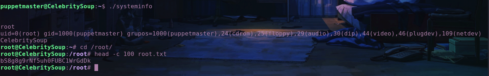

<h1 align="center" style="font-size:30px;">
   
  <a href="https://downloads.hackmyvm.eu/celebritysoup.zip">CelebritySoup</a>
   
</h1>

<h4 align="center"> Author: <a href="https://twitter.com/ShellDredd">ShellDredd</a></h4>

***

## Nmap

Oke untuk disini terdapat 3 Port. Yaitu port 21 (ftp), port 22 (ssh), dan port 80 (http)

***

## HTTP

Next kita scan directory yang ada di web dengan `gobuster` :

Yoai dah dapat file / directory yang ada di web . Next cek satu satu , dan ternyata ada hal mencurigakan di `robots.txt`.

Oke disini, ku agak bingung gimana. Ternyata setelah di cek satu persatu ada sebuah kata yang terpisah dari masing masing file. Karena itu ku buat script bash untuk mendapatkan kata itu :

Dan ketika di run menghasilkan ini :

Setelah disusun menghasilkan kata-kata `puppetmaster` yang merupakan user ssh

Next kita cari password SSH. Untuk mencarinya disini ku scan directory lagi dengan wordlist buatan, oya untuk buatnya bisa pake cewl jangan lupa install dulu kalau belum ada `apt install cewl`

Setelah selesai di buat, scan lagi kawan dengan `dirsearch`. Maka akan menghasilkan output seperti ini :

Next bar kelar scan, kita liat apa si isi website itu . Dan ternyata terdapat sebuah gambar yang menyimpan code binary, oya untuk mendapatkan binary codenya kalian bisa kesini `https://stylesuxx.github.io/steganography/`. Untuk ngambil gambarnya tinggal `CTRL + SHIFT + I`, lalu ke image dan jangan lupa save imagenya.

Next kita decode dengan `CyberChef` dan mendapatkan passwordnya.

## FINAL

Setelah masuk SSH jengjengjeng dapat user.txt :

Sedikit lagi kawan, nah step selanjutnya ku coba liat file apa saja yang terdapat di VM tersebut. Ternyata terdapat file ELF (systeminfo) yang di mana ketika di run akan menghasilkan ini : 

Karena itu ku coba radare2, dan ternyata vulnya itu ialah Path Hijacking. Oleh karena itu ku jalanin 4 command ini :

Next ketika di run, dapatlah shell rootnya dan Misi pun selesai : 

